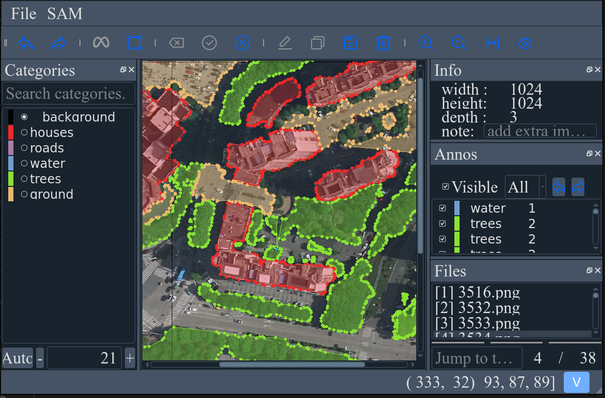

# Segmentation and Classification of GIS Data using Deep Learning

#### 分割并标注数据集

参考 [ISAT_with_segment_anything](https://github.com/yatengLG/ISAT_with_segment_anything)

```bash
# in workspace root
cd AnnotateWithSegment
python main.py
```

进入图形化界面，File -> Images dir 选择遥感图像数据集目录，进入标注截面。



标注完毕后会在图像数据集目录下生成 xximage.json 文件，包含标注信息。

#### 利用标注数据集进行训练与测试

```bash
# in workspace root
python main.py --train=True --test=True --visualize=True
```

先将标注的区域 mask 并裁剪出来，并保存为图像文件，然后处理成相同大小（128x128）的输入数据集。使用 pytorch ResNet-18 进行训练与测试，并可视化预测结果。

将标注区域的 mask 裁剪出来并保存为图像文件：

```python
# Parse JSON and Crop Regions
def parse_json_and_crop(image_path, json_path, output_dir):
    """
    Parse the JSON file and crop the regions from the image.

    Args:
        image_path (str): Path to the image file.
        json_path (str): Path to the JSON file.
        output_dir (str): Path to the output directory.

    Returns:
        List[Dict]: List of dictionaries containing the cropped regions' information.
            path (str): Path to the cropped region's image file.
            category (str): Category of the object in the cropped region.
            bbox (List[int]): Bounding box of the cropped region.
            segmentation (List[[x, y]]): List of points that define the object's segmentation.
    """
    with open(json_path, "r") as file:
        data = json.load(file)

    image = cv2.imread(image_path)
    os.makedirs(output_dir, exist_ok=True)
    annotations = []

    for obj in data["objects"]:
        category = obj["category"]
        bbox = obj["bbox"]
        x_min, y_min, x_max, y_max = map(int, [bbox[0], bbox[1], bbox[2], bbox[3]])

        segmentation = obj["segmentation"]

        # Create a binary mask for the segmentation
        mask = np.zeros(image.shape[:2], dtype=np.uint8)
        points = np.array(segmentation, dtype=np.int32).reshape((-1, 2))
        cv2.fillPoly(mask, [points], color=255)

        # Mask the image
        masked_image = cv2.bitwise_and(image, image, mask=mask)
        # Crop the image
        cropped = masked_image[y_min:y_max, x_min:x_max]
        cropped_path = os.path.join(output_dir, f"{category}_{len(annotations)}.png")
        cv2.imwrite(cropped_path, cropped)

        annotations.append(
            {
                "path": cropped_path,
                "category": category,
                "bbox": [x_min, y_min, x_max, y_max],
                "segmentation": segmentation,
            }
        )

    return annotations
```

区域图像归一化处理：

```python
# Data transforms
transform = transforms.Compose(
    [
        transforms.Resize((128, 128)),
        transforms.ToTensor(),
        transforms.Normalize(mean=[0.485, 0.456, 0.406], std=[0.229, 0.224, 0.225]),
    ]
)
```

ResNet-18 神经网络加载与训练：

```python
def train_classifier(
    image_path,
    json_path,
    output_dir,
    transform,
    categories,
    category_to_idx=None,
    epochs=15,
    batch_size=32,
    lr=0.001,
    test_size=0.2,
):
    """
    Train a classifier on cropped regions of an image.
    Args:
        image_path (str): Path to the image file.
        json_path (str): Path to the JSON file containing the annotations.
        output_dir (str): Path to the directory where the cropped regions will be saved.
        categories (list): List of categories to classify.
        category_to_idx (dict): Dictionary mapping categories to indices.
        epochs (int): Number of epochs to train.
        batch_size (int): Batch size for training.
        lr (float): Learning rate for training.
        test_size (float): Fraction of data to use for testing.
    Returns:
        model (nn.Module): Trained classifier.
    """
    print("Training classifier...")
    # Parse JSON and crop regions
    annotations = parse_json_and_crop(image_path, json_path, output_dir)

    if category_to_idx is None:
        category_to_idx = {category: idx for idx, category in enumerate(categories)}

    # Split data into train and test
    train_annotations, test_annotations = train_test_split(
        annotations, test_size=test_size, random_state=42
    )

    # Datasets and Dataloaders
    train_dataset = ImageRegionDataset(
        train_annotations, category_to_idx, transform=transform
    )
    test_dataset = ImageRegionDataset(
        test_annotations, category_to_idx, transform=transform
    )
    train_loader = DataLoader(train_dataset, batch_size=batch_size, shuffle=True)
    test_loader = DataLoader(test_dataset, batch_size=batch_size, shuffle=False)

    # Define CNN model (using a pretrained ResNet)
    model = models.resnet18(weights=models.ResNet18_Weights.DEFAULT)
    # Update final layer for our categories
    model.fc = nn.Linear(model.fc.in_features, len(categories))

    device = "cuda" if torch.cuda.is_available() else "cpu"
    model = model.to(device)

    # Loss and optimizer
    criterion = nn.CrossEntropyLoss()
    optimizer = optim.Adam(model.parameters(), lr=lr)

    # Training loop
    for epoch in range(epochs):
        model.train()
        running_loss = 0.0
        for images, labels in train_loader:
            images, labels = images.to(device), labels.to(device)
            optimizer.zero_grad()
            outputs = model(images)
            loss = criterion(outputs, labels)
            loss.backward()
            optimizer.step()
            running_loss += loss.item()

        print(f"Epoch {epoch+1}/{epochs}, Loss: {running_loss/len(train_loader)}")

    # Evaluate on test data
    model.eval()
    correct = 0
    total = 0
    with torch.no_grad():
        for images, labels in test_loader:
            images, labels = images.to(device), labels.to(device)
            outputs = model(images)
            _, predicted = torch.max(outputs.data, 1)
            total += labels.size(0)
            correct += (predicted == labels).sum().item()

    print(f"Test Accuracy: {100 * correct / total}%")
    return model

```

测试与可视化


```python
def test_classifier(
    model, test_image_path, test_json_path, categories, output_dir, transform
):
    # Parse JSON and crop test regions
    annotations = parse_json_and_crop(test_image_path, test_json_path, output_dir)
    category_to_idx = {category: idx for idx, category in enumerate(categories)}
    idx_to_category = {idx: category for category, idx in category_to_idx.items()}

    # Model evaluation mode
    model.eval()
    device = "cuda" if torch.cuda.is_available() else "cpu"
    model = model.to(device)

    true_labels = []
    predicted_labels = []

    # Iterate over test annotations
    with torch.no_grad():
        for annotation in annotations:
            image = Image.open(annotation["path"]).convert("RGB")
            image = transform(image).unsqueeze(0).to(device)
            true_label = category_to_idx[annotation["category"]]

            # Get model prediction
            output = model(image)
            _, predicted = torch.max(output, 1)

            true_labels.append(true_label)
            predicted_labels.append(predicted.item())

    # Calculate metrics
    accuracy = accuracy_score(true_labels, predicted_labels)
    f1 = f1_score(true_labels, predicted_labels, average="weighted")
    # print(f"Accuracy: {accuracy * 100:.2f}%")
    # print(f"F1 Score: {f1:.2f}")
    predicted_categories = [idx_to_category[idx] for idx in predicted_labels]
    return accuracy, f1, predicted_categories
```

```python
def visualize(
    image_path, json_path, categories, category_to_color, predicted_categories
):
    annotations = parse_json(json_path)
    category_to_idx = {category: idx for idx, category in enumerate(categories)}
    # Ground Truth Visualization
    ground_truth_image = draw_regions(
        image_path, annotations, category_to_idx, category_to_color=category_to_color
    )
    # Predictions Visualization
    predicted_image = draw_regions(
        image_path,
        annotations,
        category_to_idx,
        predicted_categories=predicted_categories,
        category_to_color=category_to_color,
    )
    # Plot the results
    plt.figure(figsize=(20, 10))
    plt.subplot(1, 2, 1)
    plt.imshow(ground_truth_image)
    plt.title("Ground Truth")
    plt.axis("off")

    plt.subplot(1, 2, 2)
    plt.imshow(predicted_image)
    plt.title("Predictions")
    plt.axis("off")

    plt.show()
```

#### 分割-分类 Pipleline

- [seg_class_pipeline.py](./seg_class_pipeline.py)

```python
image_path, json_path, output_dir = get_image_json_output_paths(image_id)
print(image_path, json_path, output_dir)
image = cv2.imread(image_path)
image = cv2.cvtColor(image, cv2.COLOR_BGR2RGB)

mask_generator = load_SamAutoMaskGenerator()
masks = mask_generator.generate(image)

# load model
from utils import load_resnet18, load_label_colors, draw_predictions
from configs import classifier_output_dir_path, categories, transform
import os
import torch

model = load_resnet18(
    os.path.join(classifier_output_dir_path, "classifier.pth"), categories
)

# predict
segments_images = collect_segments_image(image, masks)

model.eval()
device = "cuda" if torch.cuda.is_available() else "cpu"
model = model.to(device)
predicted_labels = []

with torch.no_grad():
    for seg in segments_images:
        input = transform(seg).unsqueeze(0)
        output = model(input)
        _, predicted = torch.max(output, 1)
        predicted_labels.append(predicted.item())

predicted_categories = [categories[label] for label in predicted_labels]
category_to_color = load_label_colors()
image_to_show = draw_predictions(
    image.copy(), masks, predicted_categories, category_to_color
)
figure = plt.figure(figsize=(10, 10))
plt.imshow(image_to_show)
plt.axis("off")
plt.show()
```

1 auto seg using sam


2 predict using resnet18


#### 数据增强 Data Augmentation

- [data_augmentation.py](./data_augmentation.py)

通过对原始图像进行数据增强，生成新的图像，增强数据集，提高模型的泛化能力。

主要方法：

- 缩放：将原始遥感图像放大并裁切
- 降采样：将原始遥感图像分辨率降低

```python
def create_new_dataset(source_dir, target_dir, mode="enlarge", factor=2):
    """
    Create a new dataset by enlarging or reducing images.

    :param source_dir: Directory containing the source images.
    :param target_dir: Directory to save the transformed images.
    :param mode: Mode of transformation ('enlarge' or 'reduce').
    :param factor: Enlargement or reduction factor (e.g., 2 for 4x, 3 for 9x).
    """
    os.makedirs(target_dir, exist_ok=True)
    image_files = [
        f
        for f in os.listdir(source_dir)
        if f.endswith((".png", ".jpg", ".jpeg", ".tif"))
    ]

    for image_file in image_files:
        image_path = os.path.join(source_dir, image_file)
        image = Image.open(image_path)
        image = image.convert("RGB")  # Ensure consistent mode

        if mode == "enlarge":
            new_images = enlarge_image(image, factor)
        elif mode == "reduce":
            new_images = reduce_image(image, factor)
        else:
            raise ValueError("Invalid mode. Use 'enlarge' or 'reduce'.")

        # Save new images to the target directory
        for i, new_image in enumerate(new_images):
            new_image_path = os.path.join(
                target_dir, f"{os.path.splitext(image_file)[0]}_{mode}_{i}.png"
            )
            new_image.save(new_image_path)

        print(f"Processed {image_file} -> {len(new_images)} new images.")

```

3516-origin-enlarge


3516-origin-reduce


